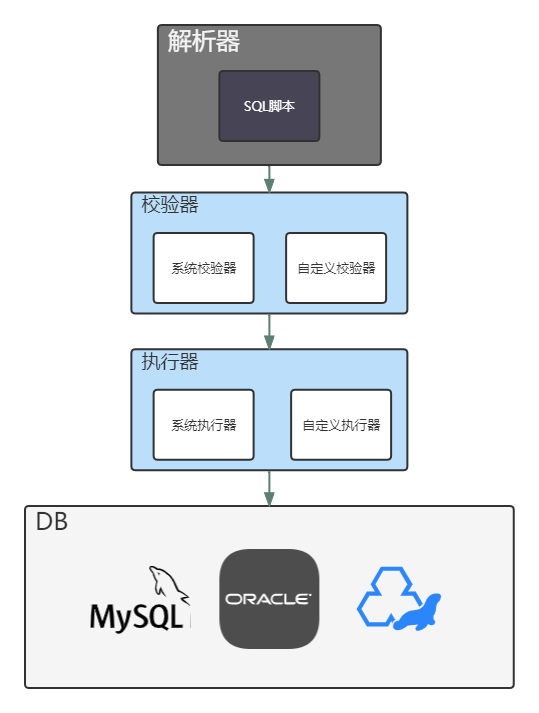

# 快速开始

## 简介
ezasse为 Easy automatic SQL script executor 的首字母简写，是一个简单的SQL脚本执行器，主要目的在于启动项目后，按照脚本定义好的规则进行检查、判断，如果满足约定条件，则执行脚本

### 主要功能
* SQL脚本执行器
* 配合git进行SQL版本管理
* 自定义SQL校验器
* 自定义SQL执行器
* 多数据源、多数据节点支持

### 官方执行器支持列表
若果一下执行器没有适配你使用的数据库，请查看[自定义执行器](#)
* [MySQL](https://github.com/PerccyKing/ezasse/blob/master/ezasse-core/src/main/java/cn/com/pism/ezasse/executor/MysqlEzasseExecutor.java)
* [Oracle](https://github.com/PerccyKing/ezasse/blob/master/ezasse-core/src/main/java/cn/com/pism/ezasse/executor/OracleEzasseExecutor.java)
* [MariaDB](https://github.com/PerccyKing/ezasse/blob/master/ezasse-core/src/main/java/cn/com/pism/ezasse/executor/MariaDbEzasseExecutor.java)
* [H2](https://github.com/PerccyKing/ezasse/blob/master/ezasse-core/src/main/java/cn/com/pism/ezasse/executor/H2EzasseExecutor.java)
* [HSQL](https://github.com/PerccyKing/ezasse/blob/master/ezasse-core/src/main/java/cn/com/pism/ezasse/executor/HsqlDbExecutor.java)

### 架构

## 立即体验

### 安装

#### 源码编译

拉取代码

```shell
git clone https://github.com/PerccyKing/ezasse.git
```

编译打包

```shell
mvn clean compile package install
```

#### SpringBoot项目

maven坐标

```xml

<dependency>
    <groupId>cn.com.pism.ezasse</groupId>
    <artifactId>ezasse-spring-boot-starter</artifactId>
    <version>0.0.2</version>
</dependency>
```

#### spring项目

maven坐标

```xml

<dependency>
    <groupId>cn.com.pism.ezasse</groupId>
    <artifactId>ezasse-core</artifactId>
    <version>0.0.2</version>
</dependency>
```

### 配置

#### SpringBoot 项目

* 在启动类上添加@EnableEzasse注解

```java

@EnableEzasse
public class Application {
    public static void main(String[] args) {
        SpringApplication.run(Application.class, args);
    }
}
```

### 编写脚本

* 在resources文件夹下，添加文件夹script

```
project
|-src
  |-main
    |-java
    |-resources
      |-script
        |-table.sql
```

* 在script文件夹中，创建文件table.sql，并编写如下内容

```sql
-- TABLE(user)
CREATE TABLE user
(
    revision     int NULL COMMENT '乐观锁',
    id           varchar(64) NOT NULL COMMENT '主键id'
        PRIMARY KEY,
    user_name    varchar(255) NULL COMMENT '用户名字',
    nick_name    varchar(255) NULL COMMENT '昵称',
    user_account varchar(255) NULL COMMENT '用户账号',
    user_type    varchar(10) NULL COMMENT '用户类型',
    secret_code  varchar(255) NULL COMMENT '密码',
    avatar       varchar(1024) NULL COMMENT '头像',
    created_id   varchar(64) NULL COMMENT '创建人id',
    created_name varchar(255) NULL COMMENT '创建人名字',
    created_time timestamp DEFAULT CURRENT_TIMESTAMP NULL COMMENT '创建时间',
    updated_id   varchar(64) NULL COMMENT '更新人id',
    updated_name varchar(255) NULL COMMENT '更新人名字',
    updated_time timestamp DEFAULT CURRENT_TIMESTAMP NULL ON UPDATE CURRENT_TIMESTAMP COMMENT '更新时间',
    deleted      bit       DEFAULT b'0' NULL COMMENT '是否删除',
    last_modify  timestamp DEFAULT CURRENT_TIMESTAMP NULL ON UPDATE CURRENT_TIMESTAMP COMMENT '最后修改时间'
) COMMENT '用户表';
-- EXEC(SELECT count(1) FROM user where id = 1)
insert into user(id, user_name) value ('1','init-user');

```

### 启动执行


