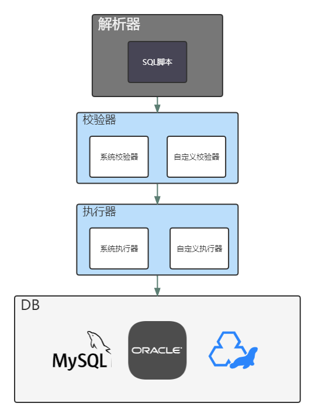

# 功能介绍
## 基础架构

* SQL脚本：一个后缀为`.sql` 的文件
* 解析器：在SQL脚本中编写好的规则已经SQL语句，会首先被解析器解析为ezasse对象
* 校验器：解析器将SQL解析后，将每个代码块传递到校验器，校验器会按照校验行的规则进行判断，以下SQL脚本是否会被执行
* 执行器：不同的数据库类型，拥有不同的执行器，主要作用是将SQL脚本在目标数据节点上进行执行

## 官方执行器支持列表
若果一下执行器没有适配你使用的数据库，请查看[自定义执行器](../expand/customer-executor.html)
* [MySQL](https://github.com/PerccyKing/ezasse/blob/master/ezasse-core/src/main/java/cn/com/pism/ezasse/executor/MysqlEzasseExecutor.java)
* [Oracle](https://github.com/PerccyKing/ezasse/blob/master/ezasse-core/src/main/java/cn/com/pism/ezasse/executor/OracleEzasseExecutor.java)
* [MariaDB](https://github.com/PerccyKing/ezasse/blob/master/ezasse-core/src/main/java/cn/com/pism/ezasse/executor/MariaDbEzasseExecutor.java)
* [H2](https://github.com/PerccyKing/ezasse/blob/master/ezasse-core/src/main/java/cn/com/pism/ezasse/executor/H2EzasseExecutor.java)
* [HSQL](https://github.com/PerccyKing/ezasse/blob/master/ezasse-core/src/main/java/cn/com/pism/ezasse/executor/HsqlDbExecutor.java)
